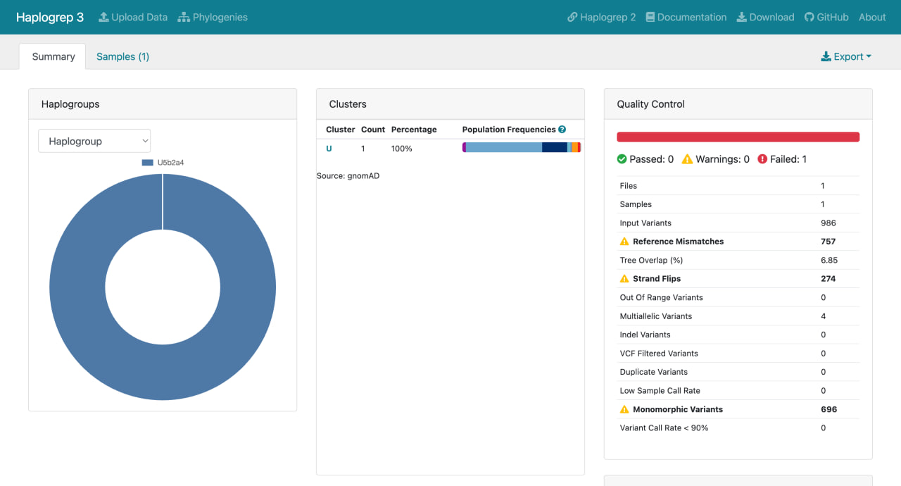
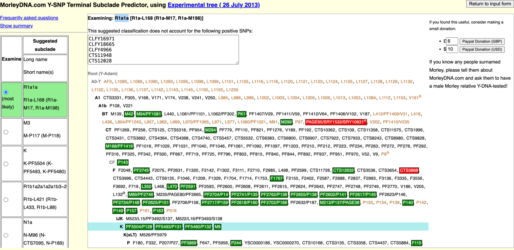

# H+ / Human Genome Variant Analysis

## 0. Project Overview

This project focuses on the analysis of human SNP-based genotyping data with the following objectives:

1. Prepare and validate genotype data (VCF format, genome build compatibility).
2. Identify maternal (mtDNA) and paternal (Y chromosome) haplogroups.
3. Infer selected phenotypic traits from genotype data.
4. Annotate variants using public databases (ClinVar, GWAS Catalog, dbSNP).
5. Identify clinically relevant variants.
6. Propose a small set of hypothetical CRISPR-based genome edits supported by literature evidence.

The analysis is performed as a reproducible bioinformatics workflow with clear separation of raw data, intermediate files, and documented commands.

Genome build compatibility and data privacy considerations are strictly maintained throughout the analysis.

---

## 1. Dataset Description

Two independent SNP-array datasets were used:

1. **Genotek VCF dataset**
2. **23andMe raw genotype dataset (v4)**

Both datasets are based on reference human genome build 37 (GRCh37 / hg19).

### 1.1 Genotek Dataset

Dataset source: Genotek  
File format: VCF  
Reference genome: hg19 (GRCh37)

Genome build was determined from the VCF header:

```bash
head -n 10 data/intermediate/genotek.vcf
```

Header line: 

##reference=hg19

Total number of variants:
```bash
grep -v "^#" data/intermediate/genotek.vcf | wc -l
```
Result: 618255 variants


---

### 1.2 23andMe Dataset

Raw genotype file:  
`data/raw/SNP_raw_v4_Full_20170514175358.txt`

Header inspection confirmed:
- We are using reference human assembly build 37


The file was converted to VCF using PLINK v1.9:

```bash
plink --23file data/raw/SNP_raw_v4_Full_20170514175358.txt \
  --recode vcf --out data/intermediate/23andme_snps_clean \
  --output-chr MT --snps-only just-acgt
```

Summary statistics:

- Total SNPs: 595401

- Mitochondrial SNPs (MT): 3286

- Y chromosome SNPs: 2084

The presence of Y chromosome variants confirms a male genotype.

## 2. Sex Inference

Sex was inferred based on the presence of Y chromosome variants.

Command used:
```bash
grep -w "^chrY" data/intermediate/genotek.vcf | wc -l
```

Result: 3556 Y chromosome variants detected.

Conclusion: The individual is genetically male (XY karyotype).

## 3. Origins
### 3.1 Mitochondrial Haplogroup (Genotek dataset)

To determine haplogroups, mitochondrial (chrM) and Y chromosome variants were extracted from the full VCF.

Initially, variants were extracted using:
```bash
(
grep "^##" data/intermediate/genotek.vcf
grep "^#CHROM" data/intermediate/genotek.vcf
grep "^chrM" data/intermediate/genotek.vcf
) > data/intermediate/mtDNA_fixed.vcf

(
grep "^##" data/intermediate/genotek.vcf
grep "^#CHROM" data/intermediate/genotek.vcf
grep "^chrY" data/intermediate/genotek.vcf
) > data/intermediate/Y_fixed.vcf
```
Number of mitochondrial variants:

```bash
wc -l data/intermediate/mtDNA_fixed.vcf
```
Result: 986 variants

Mitochondrial variants were classified using HaploGrep 3  
(PhyloTree 17 – Forensic Update 1.2).

**Input file:**  
`data/intermediate/mtDNA_fixed.vcf`

**Results:**

- Haplogroup: **U5b2a4**
- Number of mtDNA variants: 986
- Tree overlap: 6.85%
- Reference mismatches: 757
- Strand flips: 274

**Interpretation:**

Haplogroup U5 belongs to one of the oldest mitochondrial lineages in Europe (estimated age ~30,000–35,000 years). It is associated with Upper Paleolithic hunter-gatherer populations and remains common in Northern and Eastern Europe today.

The detected subclade U5b2a4 suggests deep maternal ancestry linked to ancient European populations.

**Note:**  
The relatively low tree overlap is expected for SNP-array data, since genotyping chips do not provide full mitochondrial genome coverage.
**HaploGrep classification result:**



### 3.2 Y-Chromosome Haplogroup (23andMe dataset)


Y haplogroup inference was performed using the MorleyDNA Y-SNP Subclade Predictor (Experimental tree).

The 23andMe raw genotype file was pre-processed using the Morley "extractFromAutosomal" tool, which extracts recognized Y-SNP markers from autosomal SNP-array data.

Preprocessing summary:

- 166 recognized positive Y-SNP mutations
- 733 recognized negative Y-SNP mutations
- 1086 no-calls

Result:

**Suggested haplogroup:** R1a1a  
**Subclade:** R1a-L168 (R1a-M17, R1a-M198)

Haplogroup R1a is a major Eurasian Y-chromosome lineage commonly observed in Eastern Europe, Central Asia, and parts of South Asia.

The resolution is limited by SNP-array coverage; deeper subclade determination would require high-coverage Y sequencing (e.g., BigY or whole-genome sequencing).



## 4. ClinVar Annotation (23andMe dataset)

To assess potential clinical relevance of detected variants, the 23andMe-derived VCF (GRCh37) was intersected with the ClinVar VCF (GRCh37 build) downloaded from NCBI.

### 4.1 ClinVar Intersection

ClinVar VCF (GRCh37) was downloaded and indexed:

```bash
wget https://ftp.ncbi.nlm.nih.gov/pub/clinvar/vcf_GRCh37/clinvar.vcf.gz
wget https://ftp.ncbi.nlm.nih.gov/pub/clinvar/vcf_GRCh37/clinvar.vcf.gz.tbi
```

The 23andMe VCF was compressed and indexed:
```bash
bgzip -c data/intermediate/23andme_snps_clean.vcf > data/intermediate/23andme_snps_clean.vcf.gz
tabix -p vcf data/intermediate/23andme_snps_clean.vcf.gz
```
Variant positions were extracted and used to query ClinVar:
```bash
/usr/local/bin/bcftools query -f '%CHROM\t%POS\n' data/intermediate/23andme_snps_clean.vcf.gz \
  | sort -u > data/intermediate/23andme_sites.tsv

/usr/local/bin/bcftools view -R data/intermediate/23andme_sites.tsv \
  -O v -o data/intermediate/clinvar_hits.vcf \
  data/reference/clinvar.vcf.gz
```
Total ClinVar-matched records:
```bash
wc -l results/tables/clinvar_hits.tsv
```
Result: 69,522 ClinVar entries overlapping by genomic position.

### 4.2 Distribution of Clinical Significance (CLNSIG)

Top categories observed:

- Pathogenic: 17,411

- Benign: 13,302

- Uncertain significance: 11,090

- Likely pathogenic: 6,221

- Conflicting classifications: 4,811

- Pathogenic/Likely pathogenic: 4,740

### 4.3 Pathogenic / Likely Pathogenic Filtering

Non-conflicting pathogenic variants were extracted:
```bash
awk -F'\t' '
BEGIN{IGNORECASE=1}
{
  clnsig=$7
  if (clnsig ~ /pathogenic/ && clnsig !~ /conflict/) print
}' results/tables/clinvar_hits.tsv > results/tables/clinvar_pathogenic_or_likely.tsv
```

Result: 28,384 records.

Further prioritization was performed based on ClinVar review status (CLNREVSTAT).

High-confidence subset (reviewed by expert panel or practice guideline):

```bash
awk -F'\t' '
BEGIN{IGNORECASE=1}
{
  clnsig=$7; rev=$8
  if (clnsig ~ /pathogenic/ && clnsig !~ /conflict/ &&
      (rev ~ /reviewed_by_expert_panel/ || rev ~ /practice_guideline/))
    print
}' results/tables/clinvar_hits.tsv > results/tables/clinvar_pathogenic_expert_or_guideline.tsv
```
Result: 3,180 high-confidence records.

**Interpretation**

The large number of ClinVar matches reflects the fact that most SNP-array variants are represented in ClinVar, including benign and uncertain variants.

Further prioritization is required to:

identify clinically actionable variants

remove benign polymorphisms

focus on variants with strong review status and clear disease association

The next step involves structured prioritization and selection of a limited set of clinically relevant variants for detailed interpretation.